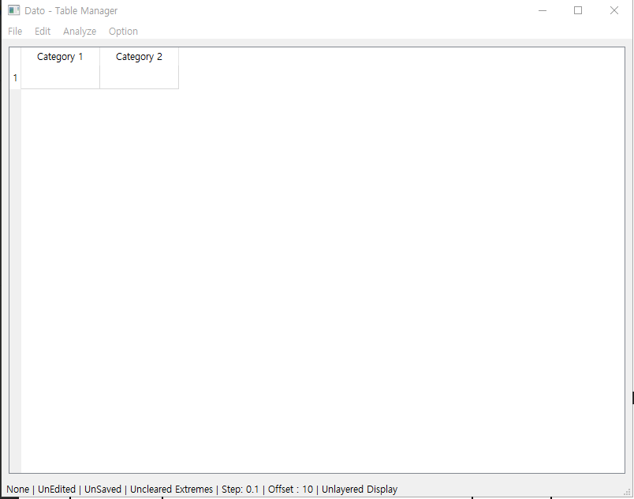

# Dato
 Dato는 경남과학고등학교 36th 오유신이 (급하게 이틀 밤 새서) 개발한, 연흔 곡률 지수 연구를 위해 만든 소프트웨어입니다. 어쨌거나 연구에 활용할 도구로써 급하게 만든 것이니, 버그 수정 등 자잘하게 다듬어지지 않은 부분이 있을 수 있습니다. 주의해주세요! 최대한 메뉴얼대로 사용하시기를 강력히 권장드립니다.
 
## 드리는 말씀
 창의재단 R&E에 참여하게 된 여러분, 반갑습니다. 따로 뭐라 얼굴을 보고 설명을 해 주고 싶은데, 시간이 그리 넉넉치 않아(조기졸업 관계로) 이렇게 글로 인사를 드리게 되었습니다. 저랑 이 연구를 공동 기획한 보민이가 여러분에게 어느 정도 설명을 해 줄 수 있을 것이라고 믿습니다만은, 일단 이 프로젝트를 기획한 사람으로써 제가 어떤 방식으로 연구를 진행해야하는지에 대하여 설명을 어느 정도라도 드리는 것이 맞을 것 같다고 생각하여 이렇게 글을 남깁니다.
 
 + 2020-10-13 추가: 지구과학실험실 복도 가운데 컴퓨터에 Dato 이 프로그램을 깔고 있습니다. 완료되면 알려드리겠습니다.
 
### 연구 방향
 이 연구의 방향성은 창의재단 계획서를 읽어보시면 대략적으로 파악이 되실 겁니다. 그래도 파악이 어렵다면, 2019년 교내 R&E 연구 보고서 모음집에서 저와 보민이의 연구를 참고하시기 바랍니다(아니면 김보민 학생에게 묻는다면 아마 드라이브에 접근해서 연구 보고서와 그 과정의 파일들을 보여줄 겁니다). 간단하게 말씀드리자면, **이 연구의 주 핵심은 연흔 상부 파형의 형태를 정량적으로 기술하는 지수를 마련한다**에 있습니다. 연흔을 옆에서 기술하는 수치들은 있는데, 위에서 기술하는 수치는 없다는 것이 주요 핵심 아이디어이죠. (보민이에게 이해가 안 된다면 물어보세요) 여튼, 1학년 연구에서 이를 진행하여 연흔 곡률 지수를 어찌어찌 개발하기는 했는데, 수학적이지 않고 엄밀하지 않아 신뢰할 수 없다는 뼈아픈 피드백을 받은 덕에, 결국 이번 창의 재단과 2학년 때의 연구를 통해서 제가 개발한 '구분선 알고리즘'이라는 수학적 기법을 사용하여 연흔 곡률 지수를 뽑아내자는 결론에 이르게 되었습니다.
 
  창의재단 연구에서 가장 핵심적인 것은, **구분선 알고리즘을 적용하여, 연흔 곡률 지수의 상응 범위를 찾는다**는 것입니다. 이미 2학년 때 저와 보민이의 과제 연구에서 연흔 곡률 지수를 어떻게 측정해야 하는지는 개발해두었습니다. 시료도 지구과학실에 어느 정도 확보되어 있는 상태이고, 과제연구를 진행하면서(교내) 인터넷에도 연흔 상부를 찍은 사진이 충분히 있다는 사실을 알게 되었습니다. 즉, 연구의 목적 중에서 '연흔 파형 분석에서 측정할 수 있는 요소의 분석'과 '연흔 구성 요소를 바탕으로 연흔 곡률 지수 수식을 산출한다'라는 부분은 이미 해결되어 있는 셈입니다.
   
 그래서 이 연구에서는 여러분은 결국 **데이터 노가다**를 해야 하는 셈이라고 말씀드릴 수 있겠습니다. 즉, 여러분이 확보할 수 있는 가능한 많은 연흔을 확보한 이후, 각각의 샘플에 대하여 저와 보민이가 2학년 과제연구에서 제시한 연흔 곡률 지수의 산출 방법대로 산출한 연흔 곡률 지수를 프로그램에 집어넣고, '경계선 알고리즘'을 이용하여 각각의 기존 정성적 분류에 상응하는 지수의 범위를 찾늕 것이 최종 목표가 되겠습니다.
  
 연흔은 기본적으로 그 파형이 생겨먹은 것에 따라서, 직선형인 Straight형에서 점차 굽이침에 따라 Sinuous형, Linguoid 형으로 분류됩니다. 우리의 목표는, 보다 많은 데이터를 가지고 Straight형, Sinuous형, Linguoid형에 해당하는 연흔 샘플들을 이미지로 수집하고(상부 사진 말하는 거에요) 이들 이미지를 기반으로 연흔 곡률 지수를 측정하고(측정하는 방법은 보민이가 알려줄 겁니다) 그 데이터들을 프로그램에 집어넣고, Straight형과 Sinuous형, Sinuous형과 Linguoid형의 경계 연흔 곡률 지수 값만 찾아내면 되는 겁니다!
  
 그러면 대충 창의재단 R&E 보고서는 제 2학년 과제 연구 보고서의 '연흔 곡률 지수' 부분을 재활용하고 남용하면 때울 수 있을 것이라고 생각됩니다. 그러니까 보고서 쓰는 건 별로 어렵지는 않을 거라고 생각합니다. 게다가, 이미 이론적 배경은 계획서에도 다량으로 포함시켜놔서, 긁어서 붙여넣고 적당히 짜집기하시기 바랍니다.
  
 추가 실험은 여러분이 땡기면 하세요. 저는 이것만 해도 시간이 좀 모자랄 수도 있다고 개인적으로 생각하고 있습니다.
  
 이제 아래에는 어떻게 분석을 진행할 것인지를 설명하겠습니다.
  
 
### 분석 방법
 아마 Straight형, Sinuous형, Linguoid형에 상응하는 경계값은 다음과 같은 과정으로 찾아질 것 같습니다. 
 우선, 각각의 형태에 해당하는(여러분이 대충 보고 분류하세요) 샘플 상부 사진을 인터넷이든 지학실에 있는 거 사진을 찍든 뭐든 해서 각각 50점 정도를 수집합니다. (다다익선입니다. 더 늘리고 싶으면 더 하시면 될 것 같아요. 하지만 50점 만으로도 이미 노가다가...) 
 그리고, 각각의 이미지를 여러분이 직접 분석해서 연흔 곡률 지수를 뽑아냅니다. (보민이에게 측정법은 물어보세요) 
 
 우리는 각각의 연흔 파형에 대한 50개의 데이터를 학습셋과 검증셋으로 나눌 겁니다. (학습셋, 검증셋과 관련된 개념은 너무 기니까 구글링해보세요)
 40개로 학습하고, 10개로 검증할 겁니다.
 
 50개 중 40개의 연흔 곡률 지수 데이터를 이제 프로그램에 집어넣고 그 경계값을 구할 겁니다. 프로그램은 제가 지학실 노트북에 깔아놓겠으니, 설치 걱정은 하지 마시고 선생님께 어느 컴퓨터에 제가 프로그램을 설치했는지 확인하시고 사용하시면 되겠습니다. 이제, 프로그램을 어떻게 사용하는지 간략하게나마 설명하겠습니다. 
 
 

 프로그램을 실행한 뒤(launcher.pyw 더블 클릭) TableManager를 실행하면 위와 같은 화면이 나올 겁니다. 
 별로 할 건 없습니다. 우선, Category 1을 더블 클릭해서 Straight로 바꿔 줍니다. Category 2도 더블 클릭해서 Sinuous로 바꿔 줍니다. 
 그리고 각각의 열에 여러분이 얻은 50개 연흔 샘플의 연흔 곡률 지수 값을 넣어 줍니다. Shift+Enter로 행을 빨리 추가할 수 있으니 참고하세요. 
 그러고 나면 여러분의 파일을 File - Save 메뉴로 csv의 형태로 저장을 합시다. 
 그리고, Analyze - Clear Extremes를 실행하고, 그 뒤에 Analyze - Calculate Border - Entropy Border를 선택하여 계산합시다. 
 정보창이 뜨면서 계산값이 표기될 겁니다. 그 값이 Straight, Sinuous 연흔 형태의 경계 연흔 곡률 지수 값에 해당합니다: 이 값은 나중에 보고서에 집어넣어야 하겠죠? 
 그리고 난 이후에, Display Border Chart를 이용해서 차트를 띄웁시다. 빨간색과 파란색 점으로 각각의 값이 표시되고, 그 경계값이 노란색 점선으로 표시되니 위쪽에 Save 메뉴를 이용해서 이미지를 저장한 후, 보고서에 집어넣을 수 있으니, 참고하기 바랍니다. 
  
 마찬가지 방법으로 Sinuous형과 Linguoid형의 상응 경계도 찾으면 됩니다. 
  
 이걸 이용해서 여러분의 창의재단 연구를 진행하시면 되겠습니다. 자세한 이야기는 김보민 학생에게 들으시기 바랍니다. 보고서 작성은 그 친구가 디렉팅할 겁니다.
 
## 마치며
 상당히 급하게 말을 마무리한 것 같다는 생각도 듭니다. 급하게 만든 프로그램에 급하게 설명하는 것이란 정말... 제 설명은 여러분이 제 1학년과 2학년 때 교내 과제연구 보고서와 창의재단 R&E 계획서를 읽어봤다는 것을 전제로 하고 있으니, 혹여 이해가 되지 않는다면 보민이에게 물어보거나 그 보고서들을 한번 쓱-훑어보시면 될 것 같습니다. 
 프로그램에 버그나 오류가 있을 수 있습니다. 매뉴얼 이외의 기능은 가급적 사용하지 말아 주세요. 프로그램 사용이나 분석에 문제가 있다면, 36기 오유신을 2학년 합강에서 찾으시기 바랍니다. 제가 가능한 힘 닿는데까지는 도울 수 있도록 하겠습니다. (개발자니까 프로그램 유지-보수는 해야 하니까요)
 1학년 여러분! 갑작스러운 R&E와 바쁜 학업 일정에도 제 긴 글을 읽어주셔서 감사합니다. 함께 최선을 다해서 좋은 결과를 만들어가도록 합시다. 감사합니다.
